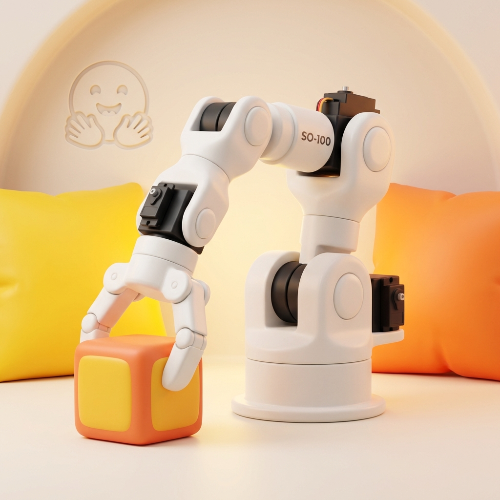

# MuJoCo UR5 Graph - 模仿學習機械手臂模擬環境



## 📖 專案簡介

本專案整合了 **MuJoCo 模擬環境** 與 **Hugging Face LeRobot 框架**，提供穩定、跨平台的機器人模仿學習研究環境。

專案基於原始作者 [chaomingsanhua](https://gitee.com/chaomingsanhua/imitation_learning_lerobot) 的開源工作進行改進，主要貢獻包括：

- **PickBoxEnv 雙手臂環境**：新增支援 UR5e + SO101 雙手臂協作的抓取任務環境
- **跨平台相容性修正**：解決 Windows 系統的 URDF 路徑與鍵盤輸入相容性問題
- **鍵盤遙操作優化**：支援數字鍵盤與 Windows 筆電替代按鍵，可切換控制不同手臂
- **GPU 渲染加速**：啟用 GLFW 渲染後端，渲染效能提升約 15-20 倍

---

## ✨ 主要功能

| 功能 | 說明 |
|------|------|
| **雙手臂模擬環境** | UR5e（搭配 Robotiq 2F-85 夾爪）+ SO101 機械手臂 |
| **鍵盤遙操作** | 支援數字鍵盤與筆電替代按鍵 |
| **LeRobot 整合** | 可輕鬆匯出訓練數據用於 ACT、SmolVLA、PI0 等模型 |
| **跨平台支援** | Windows / Linux 完整相容 |

---

## 🛠️ 安裝教學

### 1. 複製專案

```bash
git clone https://github.com/wy-zong/mujoco_ur5_graph.git
cd mujoco_ur5_graph
```

### 2. 建立虛擬環境並安裝依賴

```bash
conda create -n lerobot python=3.10
conda activate lerobot
pip install -e .
```

### 3. 常見問題處理

<details>
<summary><b>NumPy 版本衝突</b></summary>

`roboticstoolbox` 與 `rerun-sdk` 之間可能發生 NumPy 版本衝突：

```bash
pip install numpy==1.26.4
```
</details>

<details>
<summary><b>OpenCV GUI 視窗無法顯示</b></summary>

部分套件會安裝 headless 版本的 OpenCV，需手動替換：

```bash
pip uninstall opencv-python-headless -y
pip install opencv-python
```
</details>

<details>
<summary><b>Windows GPU 渲染設定</b></summary>

若模擬速度過慢，請確認已啟用 GPU 渲染：

1. 開啟 **Windows 設定 → 顯示 → 圖形**
2. 新增 `python.exe`，選擇「**高效能**」
3. 或透過 NVIDIA 控制面板設定

專案已在 `pick_box_env.py` 開頭設定 `MUJOCO_GL=glfw`。
</details>

---

## 🚀 使用說明

### 執行數據收集（鍵盤遙操作）

```bash
python imitation_learning_lerobot/scripts/collect_data_teleoperation.py \
  --env.type=pick_box \
  --handler.type=keyboard
```

> 收集的數據會儲存於 `outputs/datasets/pick_box_hdf5/` 目錄。

---

## ⌨️ 鍵盤控制說明

### 系統控制

| 功能 | 按鍵 |
|------|------|
| **開始錄製** | `Right Ctrl` |
| **暫停錄製** | `Right Shift` |
| **結束並儲存** | `Enter` |
| **切換手臂** | `0` / `Insert` (Windows 筆電) |

> 切換手臂會在 UR5 與 SO101 之間切換控制權。

### UR5 手臂控制

支援數字鍵盤與 Windows 筆電替代按鍵：

| 功能 | 數字鍵盤 | 替代按鍵 (筆電) |
|------|---------|----------------|
| **+X** (前進) | `4` | `←` Left |
| **-X** (後退) | `6` | `→` Right |
| **+Y** (左移) | `7` | `Home` |
| **-Y** (右移) | `1` | `End` |
| **+Z** (上升) | `8` | `↑` Up |
| **-Z** (下降) | `2` | `↓` Down |
| **夾爪關閉** | `9` | `Page Up` |
| **夾爪開啟** | `3` | `Page Down` |
| **Roll +/-** | `/` / `*` | - |
| **Pitch +/-** | `-` / `+` | - |
| **Yaw +** | `5` | - |

### SO101 手臂控制

SO101 使用與 UR5 相同的按鍵，但切換手臂後才會生效。

---

## 📐 動作空間說明

PickBoxEnv 使用 **14 維動作空間**：

| 索引 | 維度 | 說明 |
|------|------|------|
| 0-2 | UR5 | dx, dy, dz（位置增量）|
| 3 | UR5 | gripper（0=開, 1=關）|
| 4-6 | UR5 | roll, pitch, yaw（旋轉增量）|
| 7-9 | SO101 | dx, dy, dz（位置增量）|
| 10 | SO101 | gripper |
| 11-12 | SO101 | roll, pitch |
| 13 | - | 保留 |

---

## 📂 專案結構

```
mujoco_ur5_graph/
├── docs/                           # 文檔與資源
│   ├── assets/                     # 圖片資源
│   ├── work_logs/                  # 工作紀錄與統整
│   └── lerobot_model_architecture_guide.md  # LeRobot 模型架構指南
├── imitation_learning_lerobot/     # 核心源碼包
│   ├── envs/                       # 環境實現
│   │   └── pick_box_env.py         # PickBoxEnv 雙手臂環境 ⭐
│   ├── teleoperation/              # 遙操作控制
│   │   └── keyboard/               # 鍵盤控制器
│   ├── scripts/                    # 數據收集、推論腳本
│   ├── arm/                        # 機械手臂相關模組
│   ├── configs/                    # 環境配置
│   └── utils/                      # 工具函式
├── lerobot/                        # LeRobot 子模組 (git submodule)
├── scripts/                        # Shell 腳本
├── tests/                          # 測試與驗證腳本
│   ├── envs/                       # 環境單元測試
│   └── scripts/                    # 測試用腳本
└── setup.py                        # 安裝配置
```

---

## 📚 文檔資源

- **[LeRobot 模型架構與推論指南](docs/lerobot_model_architecture_guide.md)**  
  深入解析 ACT、SmolVLA、PI0 等模型的架構原理與訓練細節。

- **[工作紀錄](docs/work_logs/)**  
  開發過程中的階段性工作統整與技術筆記。

---

## 🔮 未來工作

- **LeRobot EnvHub 整合**：將 PickBoxEnv 打包上傳至 HuggingFace Hub，實現 `make_env("username/pickbox-env")` 直接載入。

---

## 🙏 致謝

特別感謝原始作者 **chaomingsanhua** 開源了本專案的基礎代碼。本專案是在其工作的基礎上進行改進與優化。

- **原始專案連結**：[imitation_learning_lerobot (Gitee)](https://gitee.com/chaomingsanhua/imitation_learning_lerobot)

---

## 📄 授權

[MIT License](LICENSE)
